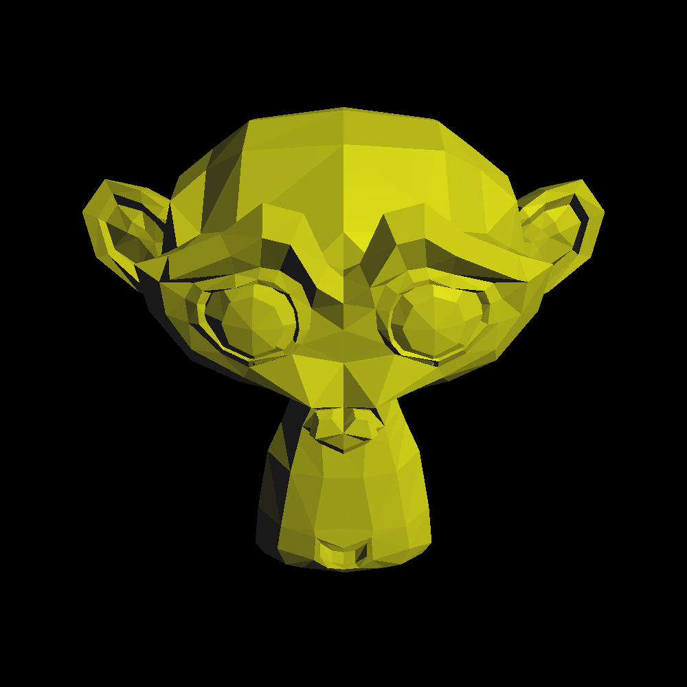

Antialiasing (anticrénelage)
============================

Malheureusement, un pixel ne correspond pas seulement à un point du plan image, mais une région, apriori carrée. En se plaçant au point d'observation, on peut observer le monde à travers cette fenêtre carrée, et on doit décider d'une couleur pour représenter ce qu'on voit dans cette région.

Dans le code donné, on ne lance qu'un seul rayon en bas à gauche du pixel, et on choisit la couleur de la lumière observée depuis ce point comme la couleur du pixel. Cela pose un problème : les pixels au travers lesquels sont visibles des bordures d'objet, par exemple, portent soit la couleur de l'objet, soit la couleur de ce qu'il y a derrière, mais jamais de mélange des deux. Quand on prend du recul pour regarder le rendu (la grille de pixels), ça donne un aspect en escalier au contour des objets : le crénelage.

L'antialiasing est une famille de procédés permettant d'éviter cet aspect crénelé caractéristique de certains algorithmes de rendu. Il existe plusieurs types d'antialiasing :

 1) on peut d'abord obtenir une image crénelée, puis la traiter pour cacher ces défauts
 2) on peut aussi tout simplement changer d'algorithme de rendu pour que le problème disparaisse ! Ce problème survient quand un algorithme n'analyse pas équitablement le contenu des pixels. La base de raytracer donnée ne lance qu'un rayon en bas à gauche du pixel, et ignore tous les détails qui pourraient se trouver dans les autres régions. On peut lancer plus de rayons dans le pixel pour obtenir une couleur plus proche de ce qu'on obtiendrait si on prenait la moyenne de tous les rayons qu'il est possible de lancer par ce pixel. Par exemple, on peut lancer 4 rayons par pixel, organisés en grille.

La première option comprend les techniques FXAA, TSAA ou SMAA, tandis que la dernière option comprend les plus simples MSAA et SMAA.

L'immense majorités des raytracers utilisent la seconde option (les pathtracers sont de toute façon obligés de lancer un grand nombre de rayons par pixel), mais vous êtes libre de choisir la première si vous avez beaucoup de temps libre.

Approche suggérée
-----------------

 - commencez par lancer plusieurs rayons par pixel, organisés en grille régulière
 - calculez la moyenne de la lumière trouvée par ces rayons avant la conversion en entier / correction gamma

Le résultat devrait déjà être relativement satisfaisant. Lancer 4 rayons par pixel est déjà une énorme amélioration. Vous pouvez améliorer vos résultats en rajoutant un petit décalage aléatoire (dont la norme est inférieure à la moitié de la distance séparant deux rayons sur la grille).

Référence
---------

   Un rendu aliasé

   Un rendu antialiasé avec 4 échantillons par pixel, en grille régulière
